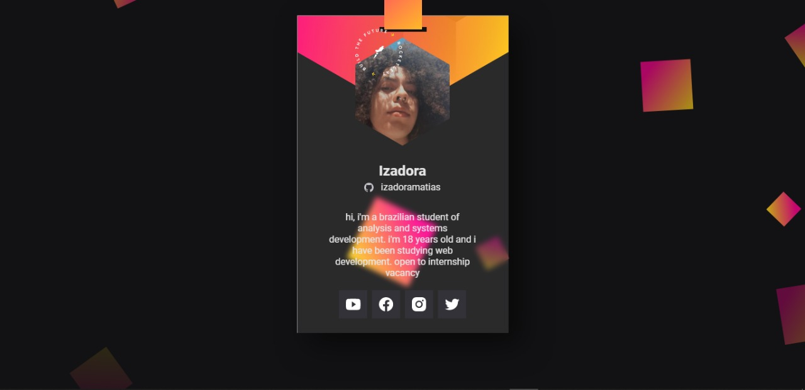

<h1 align="center">
  Crachá virtual DoWhile - 2021
</h1>

## 🚀 Tecnologias

O projeto foi desenvolvido a partir dessas tecnologias:

- HTML5
- CSS3
- JavaScript
- Vanilla-tilt

## 🌌 O projeto

O Crachá virtual foi desenvolvido pensando no evento DoWhile 2021. Cada dev pôde desenvolver seu próprio crachá, e divulgá-lo para outras pessoas e fazer networking. Além de ser também uma forma de divlgação do DoWhile 2021. 
